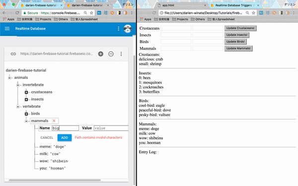

# FIREBASE: Realtime Database & Functions
初めまして！技術部サーバーチームのダリエンと申します。最近FirebaseのRealtime DatabaseとCloud Functionsを使っていましたから、Firebaseについてわかっていることをシェアしたいと思います。
## イントロダクション
### サーバーレスコンピューティング
サーバーの開発の時に、AWSなどのクラウドサーバーを使って開発することがよくあります。その理由は、自分のサーバーを立てるのも面倒だし、お金もけっこうかかるし。それに、クラウドサービスはサーバーだけを提供するのはじゃなくて、サーバーと一緒に色々な便利なサービスの提供もあります。それで、クラウドのサービスで、サーバーを立てるのはすごいシンプルになります。  

最近、小さいプロジェクトの実装の場合は、完全なサーバー環境が必要ないこともあります。
API、検証、NoSQLクラウドデータベース、とクラウドファンクションのサービスだけで、アプリを立てることができます。このようなプロジェクトに、サーバーレスコンピューティングは完璧です。 

「サーバーレスコンピューティング」というのは、クラウドサービスの一つ種類です。サーバーレスコンピューティングの費用は最初から決めなくて、動的に計算されます。普通なサービスの場合は、サーバーのスペックを選んで、そのスペックによると値段が決まります。サーバーレスコンピューティングの場合は、例えば、APIのサービスだったら、課金はAPI叩く数で計算します（xxx円/叩く）。  

実際はクラウド側にサーバーがまだ必要ですが、このようなサービスの処理は開発者から隠れていますから、開発者の観点からサーバーがない感じです。開発者はサービスの設定しか何もやりません。

### 「Firebase」というのはなんですか?  
定義（英語のウィキペディア）：モバイルとウェブアプリ開発プラットフォーム。  

FirebaseはGoogleのクラウドサービスです。提供されるサービスはモバイルとウェブ開発に特化があります。開発者はサービスを使ってアプリを立てて、インフラの部分はアプリのニーズ（負荷や帯域など）に基づいてFirebase側から自動的に調整します。  

Firebaseから提供されるサービスがたくさんありますが、このブログ投稿の中心はFirebaseのRealtime Database（NoSQLっぽい仕組みがあるデータベース）とCloud Functions（他のFirebaseの機能のトリガー関数）です。  

他の使用可能なサービスはFirebaseの公式ウェブサイトを参照してください：[Firebase](https://firebase.google.com/)  
Firebaseのスタートガイドにここを参照してください：[Firebase Docs](https://firebase.google.com/docs/)  

---
## Firebase Realtime Database
### 概要
Firebase Realtime Database（リアルタイムデータベース）はNoSQLクラウドデータベースと同期できます。データはクライアントに渡ってリアルタイムで同期されます。オフラインになっても利用可能な状態を保ちます。
Firebase Realtime Databaseの重要な特徴はデータに変更があるタイミングで全てのクライアントに更新が行うという機能です。
### 仕組み
データは普通なRDBMSの仕組み（データベースやテーブルやカラムなど）を使っていません。むしろ、JSONで保存されます。ウェブコンソールにアクセスすると、下のような仕組みで表示されます：

  

上の仕組みと下のJSONが同じ意味を持っています：
```javascript
{
  "animals" : {
    "invertebrate" : {
      "crustaceans" : {
        "cool" : "lobster",
        "small" : "shrimp"
      },
      "insects" : [ "bees", "mosquitoes", "cockroaches", "butterflies" ] //配列
    },
    "vertebrate" : {
      "birds" : {
        "cool-bird" : "eagle",
        "peaceful-bird" : "dove",
        "pesky-bird" : "vulture"
      },
      "mammals" : {
        "meme" : "doge",
        "wow" : "shibeinu",
        "wth" : "hooman"
      }
    }
  }
}
```

### データベースメソッド
* データベース参照
データのディレクトリは`firebase.database.Reference` というインスタンスで参照されます。基本的には、`firebase.database()`で、データベースの参照を取り込めます。特定なディレクトリを参照したい場合は、`firebase.database(ref)`で参照できます。このメソッドは`firebase.database.Reference`を返します。
下に述べたメソッドは`firebase.database.Reference`のインスタンスメソッドです。
* データ変更作業
基本的には、データ変更作業は三つあります：書き込み・更新、読み取り、と削除。
Firebaseのデータは**非同期的**なリスナーを`firebase.database.Reference`に付けます。初期状態で一回トリガーされます。さらに、データの変更がある場合は、その度にトリガーされます。
  * 書き込み操作
    * `set(object)`：特定の参照にデータを書き込みます。注意：その場所（子ノードも含む）にデータがある場合は、そのデータが上書きされます。
    * `push(object = {})`：`object`が指定される場合は、`set`と似ていますが、特定の場所にユニークなキーを生成して、そのキーは特定の場所につけて、そのキーの子ノードに`object`を書き込みます。`object`がない場合は、キーを返して、返したキーは他の場所で使えます。
    * `update(object)`: いくつか参照にあるデータを上書きせずに書き込みとか更新とかしたい場合は、`update`でできます。
    * `transaction(function(data), callback)`: 同時にデータ更新の可能性がある場合は、データの整合性が破損される可能性があります。データ整合性が破損されることを防ぐために、データ処理は`transaction`で含めます。あるクライアントは`transaction`でデータを更新中時に他のクライアントは同じデータも更新したかったら、その呼び出しが解消して、`function`は現在の`data`でもう一回呼び出されます。
    `function`は更新の関数、`data`は存在しているデータです。現在にあるデータを読み取って、`function`でデータを更新して、更新された`data`をリターンします。更新が成功した後、任意に`callback`を実行するもできます。
  * 読み取り
    * `on(event, callback)` または `on(event).then(callback)`：リスナーをつける時に一回トリガーされます。さらに、`reference`（子ノードも含む）に`event`が起こる場合はデータを読み取って、`callback`を実行します。
    * `once(event, callback)` または `once(event).then(callback)`：上と似ていますが、一回しか読み取りません。
    * リスナーは`off()`でデタッチすることができます。
    `callback`の`snapshot`というパラメータに`reference`にあるデータが含んでいます。
  * 削除：`remove()`で`reference`に保存されるデータを削除することができます。`update(null)`と`set(null)`でも削除できます。

プッシュのデモ：
```javascript
//データのプッシュ
firebase.database.ref('animals').push({fish: "whale"})
//結果
"animals" : {
　//他のデータ
  "-KpmdQDErPhsqEXEEF5Y" : { //push()で生成されたキー
  　fish : "whale"
  }
}
```
`push`は時間を基づいてキーを生成しますから、`push`のキーで書き込まれたデータの順番はちゃんと維持することができます。それで、データは時系列的に順番する場合は、`push`で書き込むのはおすすめです。

> `event`の一覧：[Interface: Reference | Firebase](https://firebase.google.com/docs/reference/admin/node/admin.database.Reference#on)
> 
データ一覧のソートやフィルターなどはここを参照してください：[Work with Lists of Data on the Web  |  Firebase](https://firebase.google.com/docs/database/web/lists-of-data)

### リアルタイム的にクライアントデータを更新できる機能
上に述べた`event`で、クラウドにあるデータの更新を行ったタイミングで、トリガーを自動的に実行して、クライアント側にデータはリアルタイム的に更新することができます。
事例：
チャットアプリのフロント側に`on(‘child_added’)`というフックがある場合は、ユーザーAがチャットを送信した（データベースにデータを書き込む）タイミングで、ユーザーBの画面にそのチャットがすぐ表示できます。
下記の両方のGIFは、Firebaseのリアルタイム機能を示します。  

  


### 書き込み・読み取り承認
クライアント側はデータを一定な`reference`に書き込むために、その`reference`に対して書き込み承認が必須です。ですが、機密データが存在されている`reference`がある可能性があるので、クライアントはデータをそのような`reference`に書いてはいけません。  

フロントロジックはクライアントに晒される（少なくともウェブブラウザーに）ので、このような脆弱性を防ぐために適当な承認を強制しないといけません。  

Firebase Realtime Databaseは承認の機能を持っています。基本的には、JSONで`references`の仕組みを書いて、その`references`に対して権限をつけます。
```javascript
{
  "rules": {
    "$username": {
      "id" : {
        ".read" : true,
        ".write" : false
      }
    "hobby" : {
      ".read" : true,
        ".write" : true
    }
    }
  }
}
```
`$username`の追記：変数名　(`username`)　の前に`$`がつけられます。その`$`は特別な機能を持っています。`$`がつけられると`$username`は任意なバリューが受けられます。

上のJSONで、`/$username/id`に読み取ることができますが、そこにデータを書き込むことができません。`/$username/hobby`に両方ができます。  

そのような承認を強制しつつ、開発者はまだ書き込み禁止の`reference`にデータを簡単に書き込むことができるはずです。そのために、開発のコードに（サーバーコードとか）、アドミンの権限を持たないといけません。  
アドミン権限の設定はここを参照してください：[Introduction to the Admin Database API  |  Firebase](https://firebase.google.com/docs/database/admin/start)

### RubyでFirebase Realtime Databaseを使う
[GitHub - oscardelben/firebase-ruby: Ruby wrapper for Firebase](https://github.com/oscardelben/firebase-ruby)
このgemで、RubyでFirebase Realtime DatabaseのCRUD操作を実行することができます。

### 無料アカウントの制限
* 同期接続：100
* ストレージ容量：1GB
* ダウンロード容量：10GB/月
---
## Firebase Cloud Functions
### 概要
Cloud Functionsを使うと、Firebaseの他のサービスのトリガーでバックエンドコードが自動的に実行できます。コードはGoogleのクラウドに保存されて、Googleの管理された環境で走っています。
有効なFirebaseサービスのトリガー：
* Realtime Database
* Firebase 認証
* Google Analytics for Firebase
* クラウドストレージ (Cloud Storage)
* Cloud Pub/Sub
* HTTP (エンドポイントを生成して、そのエンドポイントが叩かれるとコードが実行されます)
FirebaseサービスのトリガーとCloud Functionは同じプロジェクトに含めないといけません。

### 初期設定
1. Firebase CLIのインストール：`npm install -g firebase-tools` (Node.jsとNPMが必須)。同じコマンドでCLIを更新できます。
2. 自分のプロジェクトを初期指定：`firebase login`。このコマンドでブラウザーを開いて、自分のGoogleアカウントでログインします。
3. 自分のFirebaseプロジェクトを選択します。
   * 今度同じアカウントに他のプロジェクトに移動したい場合は、`firebase list`でプロジェクトを一覧を表示できます
   * 表示された一覧から `firebase use {プロジェクト名}`を実行して、選んだプロジェクトで作業できます。
4. Cloud Functionsの作業ディレクトリの初期指定：`firebase init functions`。任意にnpmで依存関係をインストールするオプションを提供します。他の依存管理を使いたい場合は、拒否してもいいです。
全てのコマンドがうまくいったら、プロジェクト構造はこのような感じになります：
```
project_root
 +- .firebaserc    # 隠れてるファイル：`firebase use`で簡単にプロジェクトを切り替えることができます
 |                
 +- firebase.json  # プロジェクトのプロパティについて説明します
 |
 +- functions/     # ファンクションのコード
      |
      +- package.json  # npmパッケージファイル：ファンクションコードの記載
    |
      +- index.js      # メインソース file for your Cloud Functions code
      |
      +- node_modules/ # インストールされた依存関係のディレクトリ (package.jsonに記載されています)
```
他のFirebase CLIコマンド：
* `firebase login:ci`: 非対話形式の環境で使用する認証トークンを生成します。生成されたトークンで全てのコマンドを実行します。使い方は二つあります：
  * `FIREBASE_TOKEN`環境変数に保存する場合は、自動的に用いられます。
  * 全てのコマンドは `--token {token}`フラグで実行します。
### ファンクションを書く


上のGIFはRealtime Databaseのデモと似ていますが、データを書き込んだ後に、ある新しい文字列も`message`に自動的に書き込まれました。このような機能を実装しましょう！
```javascript
const functions = require('firebase-functions');
exports.tutorial = functions.database.ref('/animals/{phylum}/{classes}')
  .onWrite(event => {
    const original = event.data.val();
    const phylum = event.params.phylum;
    const classes = event.params.classes;
    const reference = event.data.ref.root.child('/message');
    let originalKeys = Object.keys(original);
    let contentKey = originalKeys[originalKeys.length - 1];
    let content = original[contentKey];
    let key = reference.push().key;
    let logContent = {
      message: "You've created a new entry \""+contentKey+"/"+content+"\" in "+phylum+"/"+classes+" reference!"
    };
    let updates = {};
    updates[key] = logContent;
    return reference.update(updates);
});
```
1. `functions.database.ref(reference).onWrite(callback(event))`。これで`/animals/{phylum}/{classes}`でデータの変更があると`callback(event)`を実行します。
今回、イベントは`onWrite`です。`onWrite`で、どんな変更があっても`callback(event)`が実行されます。他のイベントは：
   * `onCreate`（新しいデータの書き込み）、
   * `onUpdate`（データの更新）、と
   * `onDelete`（データの削除）です。
2. `event`のオブジェクトに色々なデータが含まれますが、頻繁に使っているデータは：
   * `data.val()` -> 書き込まれたデータのバリュー
   * `data.key` -> 書き込まれたデータのキー
   * `data.ref` -> 書き込まれたデータの参照 (`firebase.database.Reference`オブジェクトを返します）。
   * `params.{wildcard}` -> 「周囲」パラメータ (“surround” parameters)。ワイルドカードで、合致されたパラメーターを晒します。上の事例に、周囲パラメータは`{phylum}`と`{classes}`です。ユーザーは`/animals/invertebrate/crustaceans`にデータを書き込む場合は、`{phylum}`は`invertebrate`になって、`{classes}`は`crustaceans`になります。
3. 欲しい参照にFirebase Realtime Databaseのメソッドでデータを書き込みます。
   1. `message`の`firebase.database.Reference`オブジェクトを`data.ref`で生成します
   2. 今回順番を守りたいので、`reference.push().key`でキーを生成します。
   3. データとキーはハッシュに入れます。
   4. `update`でハッシュをFirebase Realtime  Databaseに保存します。
4. 処理が終わった後、プロミスのオブジェクト（`set`とか、`update`とか）をリターンするのは忘れないでください。
5. 終わりです！
npmのパッケージも用いることができますので、色々な面白い実装を書き込めますよ！
### ファンクションを書く前に
コードを書く前に、注意点は下に記載します：
1. Firebase Cloud FunctionsはNode.js 6.11.1の環境で実行されます。
2. Cloud Functionsはプロミスが多用されています。ほぼ全てのFirebase Realtime Databaseの関数はプロミスオブジェクトを返すので、非同期プログラミングを使いこなしたほうがいいです。
3. プロミスという機能はJSのES6しか実装されていません。それで、ES6のシンタックスがわかったほうがいいです。
4. 無料プランでトリガーの制限がけっこうきついし、外部ネットワークにアクセスできません（外部にHTTP Requestすることができません）。
5. ログがちょっと遅いです。Cloud Functionsがトリガーされた後、ログが出て来る前に2-3秒間の遅れがあります。
6. デバッグが難しいです。オンラインでデバッグすると、ログで頼らないといけないんですが、毎回デプロイしないといけないのも不便だし、(5)の通りにログも遅いし。それで、オンラインでデバッグがやりづらくなります。オフラインデバッグの場合は、ユニットテストは`sinon`と`chai`で実装されています。非同期プログラミングをデバッグする経験があるのは必要だと思います。経験がないとデバッグがやりづらくなります。
---
## 課金
無料アカウントに色々な厳しい制限があるので、自由に使う必要があれば、課金アカウントを作ったほうがいいです。二つ課金プランがあります：固定プランと柔軟プラン（従量制）です。  
固定プランの費用は25ドル/月があります。
詳しくはここを参照してください：[Firebase Pricing](https://firebase.google.com/pricing/)

## 最終
読んでくれて、ありがとうございます！^^  
デモのコードは[GitHub - darienjonathan/firebase_tutorial](https://github.com/darienjonathan/firebase_tutorial)に書いてあります。自由にcloneとかforkしてください！